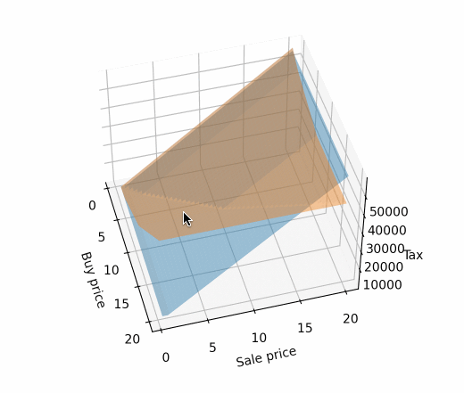

# 科创板上市期权税金计算器
## 简介
企业在中国科创板上市，允许期权跨期执行，所以会有上市前行权与上市后行权的问题。

本计算器提供一个上市前行权与上市后行权税金的对比功能。

## 使用
### 输入期权相关参数
需要定义如下参数：
- 上市前每股申报价值（元/股）
```py
pre_price = 1.1111
```
- 多次授予各次行权价格（采用数组形式输入，格式为：[授予股数, 行权价格] ）:
```py
# 如第一次以0.1元/股的价格授予10000股，第二次以0.2元/股的价格授予5000股
options = [[10000, 0.1], [5000, 0.2]]
```
如果是RSU，需要将行权价格为设定0

### 直接计算税金
可以直接计算上市前行权与上市后行权所需缴纳的税金：
```py
# 上市后行权每股市价（元/股）
buy_price = 1
# 持股平台减持价格（元/股）
sale_price = 3
print(f'上市前行权需交纳税金{pre_tax(sale_price)}')
print(f'上市后行权需交纳税金{post_tax(buy_price, sale_price)}')
```

### 不同方式比较
也可以生成三维曲面对比两种方式在不同*上市后行权每股市价*和*持股平台减持价格*下的税金差异：
```py
# 对比中最高/最低上市后行权每股市价
min_buy_price = 0.5
max_buy_price = 20
# 对比中最高/最低持股平台减持价格
min_sale_price = 0.5
max_sale_price = 20

plot_compare(min_buy_price, max_buy_price, min_sale_price, max_sale_price)
```


# 注

基于2021.2的税务规则进行计算，未考虑其他个人收入影响累进税率的情况，结果仅供参考。